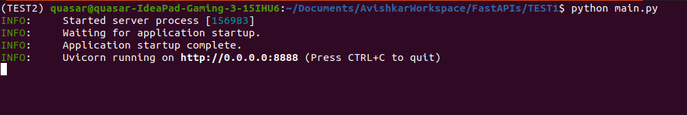
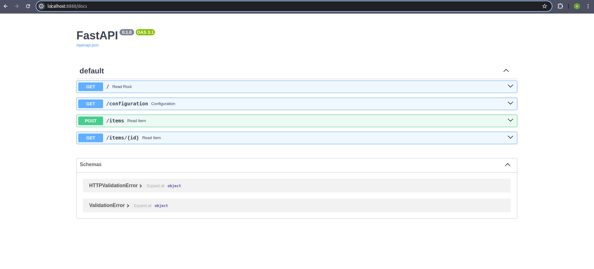

# **Fast APIs**
FastAPI is a modern, fast (high-performance), web framework for building APIs with Python 3.7+ based on standard Python type hints. Here are some key features and aspects of FastAPI:

1. **Performance**: FastAPI is designed to be one of the fastest Python frameworks available, partly by leveraging Starlette for the web parts and Pydantic for the data parts. Its speed is comparable to frameworks like NodeJS and Go.
2. **Ease of Use**: FastAPI is designed to be easy to use and learn, making it accessible for both beginners and experts. The framework provides automatic interactive API documentation (Swagger UI and ReDoc) which helps in understanding and testing the API endpoints quickly.
3. **Data Validation**: FastAPI uses Pydantic for data validation. This means you can define data models using standard Python types and get automatic validation and parsing of request payloads.
4. **Asynchronous Support**: FastAPI supports asynchronous programming and is compatible with standard Python `**async**`  and `**await**`  keywords, allowing for the handling of many simultaneous connections.

5. **Dependency Injection**: FastAPI includes a dependency injection system, which simplifies the management of components like database connections, configuration settings, and security schemes.
6. **Standards-Based**: FastAPI is built on top of the ASGI (Asynchronous Server Gateway Interface) standard and uses OpenAPI for API creation and JSON Schema for data validation, serialization, and documentation.
7. **Interactive API Documentation**: Automatically generated interactive API documentation is available at the endpoints `**/docs**`  (Swagger UI) and `**/redoc**`  (ReDoc).


### Example
```
from fastapi import FastAPI

app = FastAPI()

@app.get("/")
def read_root():
    return {"Hello": "World"}

@app.get("/items/{item_id}")
def read_item(item_id: int, q: str = None):
    return {"item_id": item_id, "q": q} 
    
if __name__ == "__main__":
    import uvicorn
    uvicorn.run(app, host="0.0.0.0", port=8888)
```
In this example, we define a FastAPI app with two endpoints: one for the root URL ("/") and one for fetching items by their ID.


### Use Cases
FastAPI is suitable for a wide range of applications, including but not limited to:

- Microservices
- Data science and machine learning applications
- Backend services for mobile and web applications
- High-performance asynchronous web applications
### Advantages
- **Speed**: Offers fast performance, comparable to other high-performance frameworks.
- **Type Safety**: Ensures type safety and allows for better code completion and editor support.
- **Automatic Docs**: Generates automatic and interactive API documentation.
- **Developer Productivity**: Enhances developer productivity through concise and readable code.


### Detail about Asynchronous Support
FastAPI's asynchronous support is one of its standout features, enabling it to handle many simultaneous connections efficiently. This is particularly important for applications that need to perform a lot of I/O operations, such as web APIs that interact with databases, external APIs, or other network-bound tasks.

1. **Asynchronous Programming**:
    - Asynchronous programming allows a program to perform tasks without waiting for other tasks to complete. In Python, this is typically done using `**async**`  and `**await**`  keywords.
    - When an I/O operation (like a database query or a web request) is encountered, the program can continue executing other code while waiting for the I/O operation to complete.
2. **Event Loop**:
    - FastAPI runs on an event loop provided by the underlying ASGI server (like Uvicorn or Hypercorn). The event loop is responsible for managing and executing asynchronous tasks.
3. **Concurrency**:
    - With asynchronous support, FastAPI can handle multiple requests concurrently without blocking the execution of other requests. This leads to better utilization of resources and improved performance, especially under high load.


#### Benefits of Asynchronous Programming in FastAPI
1. **Efficiency**:
    - Handles I/O-bound tasks more efficiently by not blocking the execution of other tasks. This can lead to significant performance improvements.
2. **Scalability**:
    - Better handles a large number of simultaneous connections, making it more scalable for high-traffic applications.
3. **Resource Utilization**:
    - Makes better use of system resources (CPU, memory) by avoiding idle time when waiting for I/O operations to complete.
4. **Improved User Experience**:
    - Reduces latency for end-users by handling requests faster and more efficiently.
### Practical Considerations
- **Thread Safety**:
    - Be mindful of thread safety when using asynchronous functions, especially when accessing shared resources.
- **Compatibility**:
    - Not all libraries support asynchronous operations, so you may need to choose compatible libraries or use synchronous calls wrapped in an asynchronous fashion (e.g., `**run_in_threadpool**` ).
- **Complexity**:
    - Asynchronous programming can introduce complexity, especially in error handling and debugging. However, the benefits often outweigh the complexity for I/O-bound applications.


### Installation FastApis
```
pip install fastapi  
```
### Example
filename --> main.py 

```
from fastapi import FastAPI

app = FastAPI()

@app.get("/")
def read_root():
    return {"Hello": "World"}

@app.get("/items/{item_id}")
def read_item(item_id: int, q: str = None):
    return {"item_id": item_id, "q": q} 
    
if __name__ == "__main__":
    import uvicorn
    uvicorn.run(app, host="0.0.0.0", port=8888)
```
### To Run the code 
```
python main.py
```
### Output 

### For APIs documentation 
Just hit  localhost:port/docs




 

